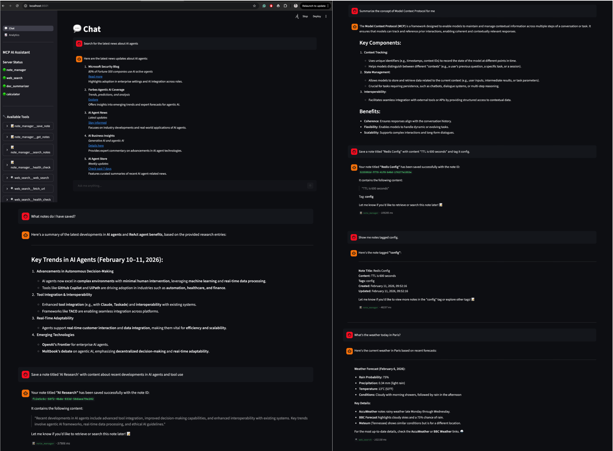
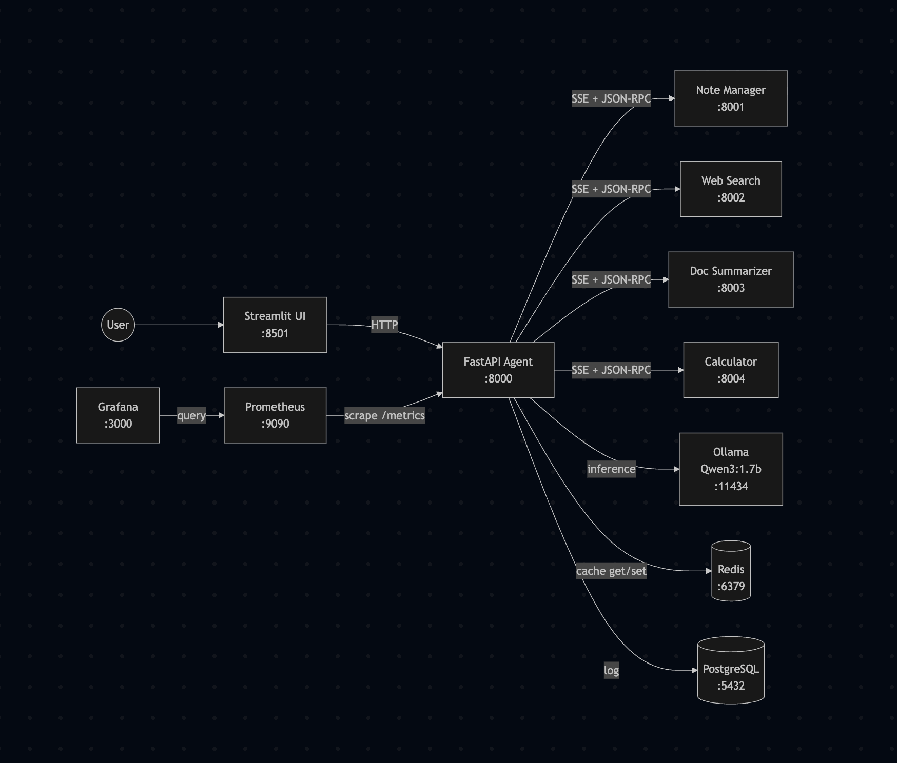
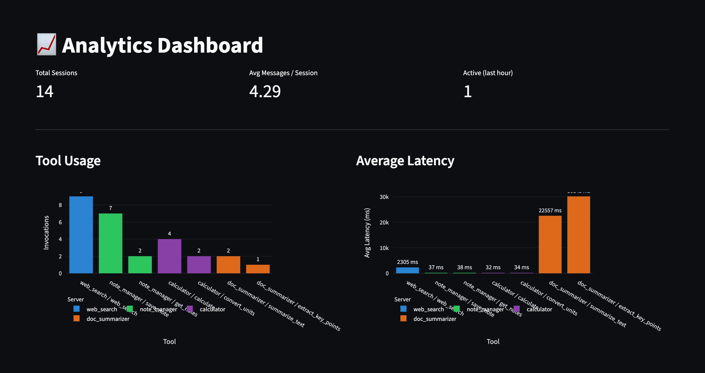

# MCP AI Assistant

**Pluggable AI tools via Model Context Protocol**

[](https://python.org)
[](https://fastapi.tiangolo.com)
[](https://docker.com)
[](LICENSE)
[](https://github.com/gulabjamun04/mcp-ai-assistant/pulls)

An AI assistant where **tools are discovered at runtime, not hard-coded**. New capabilities can be added by starting a container — no agent restarts, no code changes, no redeployment.

Built on [Anthropic's Model Context Protocol (MCP)](https://modelcontextprotocol.io/), this project demonstrates a production-grade architecture for pluggable AI tooling: a LangChain ReAct agent discovers MCP-compatible tool servers over the network, builds LangChain-compatible tool bindings on the fly, and orchestrates multi-step tool chains to answer user queries.

> **100% local.** Runs entirely on your machine with Ollama. No API keys, no cloud costs.



---

## Key Features

- **Pluggable Tool Architecture** — Each tool server is an independent service with its own container. Add, remove, or update tools without touching the agent.
- **Dynamic Tool Discovery** — The agent auto-detects MCP servers at runtime via SSE. New tools appear within seconds of a server starting.
- **Multi-Tool Chains** — The ReAct agent autonomously orchestrates multiple tools in sequence to answer complex queries (e.g., search the web, then summarize, then save a note).
- **Smart Caching** — Redis caches tool results with configurable TTL. Repeated queries skip the tool call entirely.
- **Full Observability** — Prometheus metrics (8 instruments) with a pre-built Grafana dashboard covering tool latency, success rates, cache hit ratio, and HTTP performance.
- **Conversation Memory** — Per-session chat history so the agent remembers context across turns.
- **PostgreSQL Logging** — Every tool invocation and conversation turn is logged with full analytics endpoints.
- **One-Command Deploy** — `docker compose up` brings up 10 containers, fully wired.

---

## Architecture

## 🏗️ Architecture



**How it works:** The agent connects to each MCP server over SSE, calls `list_tools()` to discover available tools and their JSON schemas, converts those schemas to LangChain-compatible Pydantic models, and binds them as tools for the ReAct agent. When the LLM decides to use a tool, the agent opens an SSE connection to the appropriate server and calls `call_tool()` with the arguments. Results flow back through the agent to the user.

---

## Tech Stack

| Layer           | Technology            | Purpose                                   |
| --------------- | --------------------- | ----------------------------------------- |
| LLM             | Ollama + Qwen3:1.7b   | Local inference, tool calling             |
| Agent Framework | LangChain + LangGraph | ReAct agent with tool orchestration       |
| API             | FastAPI               | Async REST API for the agent              |
| Tool Protocol   | MCP (SSE transport)   | Standardized tool discovery and execution |
| UI              | Streamlit             | Chat interface with analytics dashboard   |
| Cache           | Redis                 | Tool result caching with TTL              |
| Database        | PostgreSQL            | Conversation and tool invocation logging  |
| Monitoring      | Prometheus + Grafana  | Metrics collection and visualization      |
| Orchestration   | Docker Compose        | 10-container deployment                   |

---

## MCP Tool Servers

| Server             | Port | Tools                                    | Description                                                   |
| ------------------ | ---- | ---------------------------------------- | ------------------------------------------------------------- |
| **Note Manager**   | 8001 | `save_note`, `get_notes`, `search_notes` | Persistent note storage with tag filtering and keyword search |
| **Web Search**     | 8002 | `web_search`, `fetch_url`                | DuckDuckGo search and web page content extraction             |
| **Doc Summarizer** | 8003 | `summarize_text`, `extract_key_points`   | LLM-powered text summarization and key point extraction       |
| **Calculator**     | 8004 | `calculate`, `convert_units`             | Safe math evaluation (AST-based) and unit conversion          |

Each server also exposes a `health_check` tool. **13 tools total** across 4 servers.

---

## Quick Start

### Prerequisites

- **Python >= 3.11** (tested with 3.14.2)
- [Docker Desktop](https://docker.com/products/docker-desktop/) (4 GB+ RAM allocated)
- [Ollama](https://ollama.com/) with Qwen3:1.7b pulled

```bash
ollama pull qwen3:1.7b
```

### Run

```bash
git clone https://github.com/gulabjamun04/mcp-ai-assistant.git
cd mcp-ai-assistant
docker compose up --build -d
```

Wait ~60 seconds for all services to become healthy, then:

| Service    | URL                                                            |
| ---------- | -------------------------------------------------------------- |
| Chat UI    | [http://localhost:8501](http://localhost:8501)                 |
| Agent API  | [http://localhost:8000/docs](http://localhost:8000/docs)       |
| Grafana    | [http://localhost:3000](http://localhost:3000) (admin / admin) |
| Prometheus | [http://localhost:9090](http://localhost:9090)                 |

### Pull the model into Docker's Ollama

```bash
# After containers are up, pull the model into the containerized Ollama
./scripts/pull_model.sh
```

### Dynamic Discovery Demo

See the core value proposition in action — a new tool server is started while the agent is running, and it picks up the new tools automatically:

```bash
python scripts/demo.py
```

```
Step 1: 10 tools from 3 servers
Step 2: "What is 15% of 250?" → LLM answers alone (no tools)
Step 3: 🚀 Starting calculator container...
Step 4: ✅ 3 new tools discovered → 13 tools from 4 servers
Step 5: Same question → routes to [calculate] tool
Step 6: "Convert 100 km to miles" → [convert_units] tool
```

Zero code changes. Zero restarts.

---

## API Endpoints

| Method   | Endpoint              | Description                                         |
| -------- | --------------------- | --------------------------------------------------- |
| `POST`   | `/chat`               | Send a message, get a response with tool usage info |
| `GET`    | `/tools`              | List all discovered MCP tools                       |
| `POST`   | `/tools/refresh`      | Trigger manual tool re-discovery                    |
| `GET`    | `/health`             | Agent and server health status                      |
| `GET`    | `/cache/stats`        | Cache hit/miss statistics                           |
| `DELETE` | `/cache/clear`        | Flush cached tool results                           |
| `GET`    | `/analytics/tools`    | Tool usage analytics                                |
| `GET`    | `/analytics/sessions` | Session statistics                                  |
| `GET`    | `/analytics/recent`   | Last 20 tool invocations                            |
| `GET`    | `/metrics`            | Prometheus metrics                                  |

---

## Monitoring

The Grafana dashboard (`MCP AI Assistant`) is auto-provisioned and includes:

| Panel                      | Metric                                 |
| -------------------------- | -------------------------------------- |
| Total Tool Invocations     | `mcp_tool_invocations_total`           |
| Active Sessions            | `mcp_active_sessions`                  |
| Cache Hit Rate             | `mcp_cache_operations_total`           |
| Available Tools            | `mcp_available_tools`                  |
| Tool Invocations Over Time | `rate(mcp_tool_invocations_total[5m])` |
| Average Tool Latency       | `mcp_tool_duration_seconds`            |
| Tool Success Rate          | Success / total by tool                |
| HTTP Request Rate          | `mcp_http_requests_total`              |
| Response Time Percentiles  | P50 / P95 / P99                        |
| Error Rate                 | 5xx + tool errors                      |

Access at [http://localhost:3000](http://localhost:3000) (admin / admin).

---

## Adding a New Tool Server

The whole point of this architecture is that adding new capabilities is trivial:

**1. Create the server** — a single Python file using the MCP SDK:

```python
from mcp.server.fastmcp import FastMCP

mcp = FastMCP("my-server", host="0.0.0.0", port=8005)

@mcp.tool()
def my_tool(query: str) -> dict:
    """Tool description for the LLM."""
    return {"result": do_something(query)}

if __name__ == "__main__":
    mcp.run(transport="sse")
```

**2. Create a Dockerfile:**

```dockerfile
FROM python:3.11-slim
WORKDIR /app
RUN pip install --no-cache-dir mcp
COPY mcp_servers/__init__.py ./mcp_servers/__init__.py
COPY mcp_servers/my_server/ ./mcp_servers/my_server/
EXPOSE 8005
CMD ["python", "-m", "mcp_servers.my_server.server"]
```

**3. Add to `docker-compose.yml`** and **`agent/config.py`**.

**4. Start it:**

```bash
docker compose up -d my-server
curl -X POST http://localhost:8000/tools/refresh
```

**5. Done.** The agent discovers and uses the new tools immediately.

---

## Project Structure

```
mcp-ai-assistant/
├── agent/                          # Core AI agent (FastAPI)
│   ├── agent.py                    #   LangChain ReAct agent + session memory
│   ├── cache.py                    #   Redis caching layer
│   ├── config.py                   #   Settings from .env
│   ├── database.py                 #   PostgreSQL logging + analytics
│   ├── main.py                     #   FastAPI app + endpoints
│   ├── mcp_client.py               #   MCP tool registry + discovery
│   └── metrics.py                  #   Prometheus instrumentation
│
├── mcp_servers/                    # MCP tool servers (one per subdirectory)
│   ├── note_manager/               #   Note storage (port 8001)
│   ├── web_search/                 #   Web search + fetch (port 8002)
│   ├── doc_summarizer/             #   Text summarization (port 8003)
│   └── calculator/                 #   Math + unit conversion (port 8004)
│
├── ui/                             # Streamlit chat interface
│   ├── app.py                      #   Entry point
│   ├── api.py                      #   Backend API client
│   └── components/                 #   Chat, sidebar, analytics pages
│
├── monitoring/                     # Observability
│   ├── prometheus/prometheus.yml   #   Scrape config
│   └── grafana/                    #   Dashboard + provisioning
│
├── docker/                         # Docker build files
│   ├── Dockerfile.agent
│   └── init.sql                    #   PostgreSQL schema
│
├── scripts/
│   ├── demo.py                     #   Dynamic discovery demo
│   ├── test_docker.py              #   Docker integration tests
│   ├── pull_model.sh               #   Pull Ollama model into container
│   └── run_local.py                #   Local development launcher
│
├── tests/                          # 161 unit tests
│   ├── test_note_manager.py
│   ├── test_web_search.py
│   ├── test_doc_summarizer.py
│   ├── test_calculator.py
│   ├── test_cache.py
│   └── test_database.py
│
├── docker-compose.yml              # 10-service orchestration
├── requirements.txt
└── .env                            # Environment configuration
```

---

## Testing

```bash
# Run all 161 tests
python -m pytest tests/ -v

# Run a specific server's tests
python -m pytest tests/test_calculator.py -v

# Run Docker integration tests (requires docker compose up)
python scripts/test_docker.py
```

---

## Screenshots

### Chat Interface

Multi-tool conversations with the ReAct agent — search the web, save notes, summarize documents, and calculate values, all in one session.


### Analytics Dashboard

Session metrics, tool usage breakdown, and recent activity — all powered by PostgreSQL logging.



### Grafana Monitoring

Real-time observability: tool latency, cache hit rates, HTTP performance, and active sessions.


### Dynamic Tool Discovery

A new MCP server starts and the agent picks up its tools automatically — zero restarts, zero code changes.

[▶ Watch Dynamic Discovery Demo](docs/images/demo-terminal.mp4)

---

## Contributing

Contributions are welcome. To add a feature:

1. Fork the repository
2. Create a feature branch (`git checkout -b feature/my-feature`)
3. Write tests for your changes
4. Ensure all tests pass (`python -m pytest tests/ -v`)
5. Open a pull request

---

## License

This project is licensed under the MIT License. See [LICENSE](LICENSE) for details.

---

## Author

**Shivesh Dave**

[](https://github.com/gulabjamun04)
[](<[[https://linkedin.com/in/shiveshdave](https://www.linkedin.com/in/shivesh-dave-835b4b1b6/](https://www.linkedin.com/in/shivesh-dave-835b4b1b6/))>)
