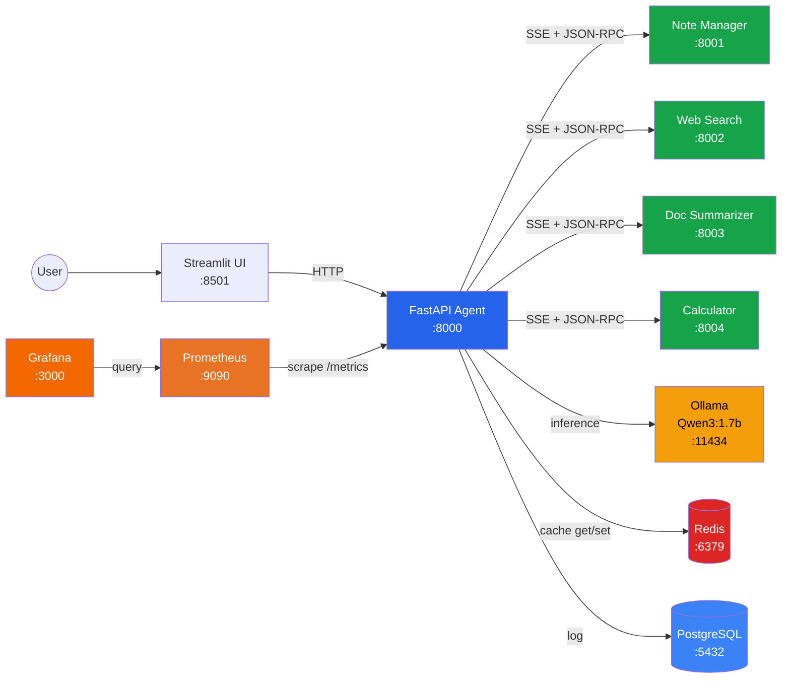

# Architecture

Detailed system architecture for the MCP AI Assistant.

---

## System Overview

The MCP AI Assistant is a multi-service application where an AI agent discovers and orchestrates tools at runtime using Anthropic's [Model Context Protocol (MCP)](https://modelcontextprotocol.io/). Tool servers are independent processes that can be started, stopped, or replaced without touching the agent.



---

## How MCP Works in This Project

The Model Context Protocol defines a standard way for AI agents to discover and call tools over the network. In this project:

### Protocol Details

- **Transport**: Server-Sent Events (SSE). Each MCP server exposes an `/sse` endpoint.
- **Message format**: JSON-RPC 2.0 over the SSE stream.
- **Operations used**:
  - `initialize` — handshake between client and server
  - `tools/list` — server returns all available tools with JSON Schema descriptions
  - `tools/call` — client invokes a specific tool with arguments, server returns results

### How the Agent Uses MCP

1. **Agent starts** — `MCPToolRegistry.discover_tools()` connects to every configured MCP server URL via SSE.
2. **For each server** — opens an SSE connection, calls `initialize`, then `tools/list`.
3. **Schema conversion** — each tool's JSON Schema is converted into a Pydantic model via `_json_schema_to_pydantic()`, then wrapped as a LangChain `StructuredTool`.
4. **Tool binding** — all `StructuredTool` instances are passed to `create_react_agent(model, tools)`, making them available to the LLM.
5. **Tool execution** — when the LLM emits a tool call, the agent opens a fresh SSE connection to the correct server and calls `tools/call` with the arguments. The connection is closed after each call (simple, resilient).
6. **Background refresh** — every 30 seconds, `_background_refresh()` re-runs discovery to pick up new/removed servers.

### Tool Namespacing

Tools are namespaced as `{server_name}__{tool_name}` (e.g. `note_manager__save_note`). This prevents collisions — all 4 servers expose a `health_check` tool, but they become `note_manager__health_check`, `web_search__health_check`, etc. When calling a tool on its MCP server, the original `mcp_name` (without prefix) is used.

---

## Data Flow

### Chat Request Flow

```
User types message
       │
       ▼
┌─────────────┐    POST /chat     ┌──────────────────────────┐
│ Streamlit UI │ ───────────────▶ │ FastAPI Agent (:8000)     │
│   (:8501)    │                  │                          │
└─────────────┘                  │  1. Load session history  │
                                 │  2. Build ReAct agent     │
                                 │  3. Invoke with message   │
                                 │         │                 │
                                 │         ▼                 │
                                 │  ┌─────────────────┐     │
                                 │  │ LangGraph ReAct  │     │
                                 │  │ (ChatOllama)     │     │
                                 │  └────────┬────────┘     │
                                 │           │               │
                                 │    LLM decides to         │
                                 │    call a tool             │
                                 │           │               │
                                 │           ▼               │
                                 │  ┌─────────────────┐     │
                                 │  │ MCPToolRegistry  │     │
                                 │  │  .call_tool()    │     │
                                 │  └────────┬────────┘     │
                                 │           │               │
                                 └───────────┼───────────────┘
                                             │
                          ┌──────────────────┼──────────────────┐
                          ▼                  ▼                  ▼
                    ┌───────────┐     ┌───────────┐     ┌───────────┐
                    │ Redis     │     │ MCP Server│     │PostgreSQL │
                    │ (check    │     │ (SSE call)│     │ (log      │
                    │  cache)   │     │           │     │  invocation)
                    └───────────┘     └───────────┘     └───────────┘
```

### Step-by-Step

1. **User** sends a message via the Streamlit chat UI.
2. **Streamlit** POSTs to `http://agent:8000/chat` with `{message, session_id}`.
3. **FastAPI** loads the session's conversation history (in-memory, last 10 turns).
4. **LangGraph ReAct agent** is created with `ChatOllama` (Qwen3:1.7b) and all discovered LangChain tools.
5. **Agent reasoning loop**: the LLM decides whether to call a tool or respond directly.
6. **If a tool is called**:
   - `MCPToolRegistry.call_tool()` checks **Redis cache** first.
   - On cache miss, opens an SSE connection to the MCP server, calls the tool, gets the result.
   - Stores the result in Redis (with TTL) for future cache hits.
   - Logs the invocation to **PostgreSQL** (fire-and-forget via `asyncio.create_task`).
   - Records **Prometheus metrics** (counter + histogram).
7. The tool result flows back to the LLM, which may call more tools or produce a final answer.
8. **Response** is returned to Streamlit with `{response, tools_used, latency_ms}`.
9. **Conversation** is logged to PostgreSQL (fire-and-forget).

---

## Dynamic Tool Discovery

This is the core differentiator of the architecture. Tools are not hard-coded — they are discovered at runtime.

### How It Works

```
Startup                              Runtime (new server appears)
───────                              ──────────────────────────────
Agent starts                         User starts mcp-calculator
       │                                    │
       ▼                                    ▼
discover_tools()                     Container becomes healthy
       │                                    │
       ├── SSE → note_manager ✓             │
       ├── SSE → web_search ✓        POST /tools/refresh
       ├── SSE → doc_summarizer ✓      (or background refresh)
       └── SSE → calculator ✗               │
           (connection refused)              ▼
                                     discover_tools()
Result: 10 tools from 3 servers            │
                                     ├── SSE → note_manager ✓
                                     ├── SSE → web_search ✓
                                     ├── SSE → doc_summarizer ✓
                                     └── SSE → calculator ✓ ← NEW

                                     Result: 13 tools from 4 servers
                                     Agent immediately uses new tools
```

### Discovery Mechanisms

1. **Startup discovery** — `discover_tools()` runs during FastAPI's lifespan startup. Servers that are down are logged as warnings and skipped.
2. **Background refresh** — an `asyncio.Task` runs `refresh_tools()` every 30 seconds, detecting newly available or removed servers.
3. **Manual refresh** — `POST /tools/refresh` triggers immediate re-discovery and returns a diff (`added`, `removed`, `total`).

### Graceful Degradation

- If a server is unreachable during discovery, it is skipped — the agent works with the tools it has.
- If a server goes down between discoveries, tool calls to it will fail and return an error JSON. The agent handles this gracefully and informs the user.
- Cache, database, and monitoring failures are all non-fatal. The agent continues working without them.

---

## Caching Strategy

Redis caches MCP tool results to avoid redundant calls to tool servers.

### How It Works

```
call_tool("web_search__web_search", {"query": "Python MCP"})
       │
       ▼
  ┌─────────────┐
  │ Cache key =  │  SHA-256 of {tool_name + sorted(arguments)}
  │ mcp_cache:   │  e.g. "mcp_cache:web_search__web_search:a3f8b2c1..."
  │ web_search.. │
  └──────┬──────┘
         │
    ┌────▼────┐
    │ Redis   │──── HIT? ──── return cached result (skip MCP call)
    │  GET    │
    └────┬────┘
         │ MISS
         ▼
    Call MCP server
         │
         ▼
    ┌─────────┐
    │ Redis   │──── SETEX with TTL (600s = 10 min)
    │  SET    │
    └─────────┘
```

### Key Design Decisions

- **Key format**: `mcp_cache:{tool_name}:{sha256_prefix}` — deterministic, collision-resistant.
- **TTL**: 600 seconds (10 minutes) by default. Configurable per `RedisCache` instance.
- **Exclusions**: `health_check` tools are never cached (they should always reflect live state).
- **Graceful fallback**: if Redis is unavailable, caching is silently disabled. The agent continues to work, just without cache benefits.
- **Cache management**: `DELETE /cache/clear` flushes all `mcp_cache:*` keys. `GET /cache/stats` returns hit/miss counts and hit rate.

---

## Database Schema

PostgreSQL stores all conversation and tool invocation data for analytics.

### Tables

```sql
sessions
├── id              UUID        PRIMARY KEY
├── created_at      TIMESTAMPTZ DEFAULT NOW()
├── last_active     TIMESTAMPTZ DEFAULT NOW()
└── message_count   INTEGER     DEFAULT 0

tool_invocations
├── id              UUID        PRIMARY KEY (auto-generated)
├── session_id      UUID        FK → sessions(id)
├── tool_name       VARCHAR(255)    e.g. "note_manager__save_note"
├── server_name     VARCHAR(255)    e.g. "note_manager"
├── input_data      JSONB           tool arguments
├── output_data     JSONB           tool result
├── latency_ms      DOUBLE          execution time
├── cache_hit       BOOLEAN         was result from cache?
├── status          VARCHAR(50)     "success" or "error"
└── created_at      TIMESTAMPTZ

conversations
├── id              UUID        PRIMARY KEY (auto-generated)
├── session_id      UUID        FK → sessions(id)
├── role            VARCHAR(50)     "user" or "assistant"
├── content         TEXT            message text
├── tools_used      JSONB           list of tool names (assistant only)
└── created_at      TIMESTAMPTZ
```

### Indexes

- `idx_tool_invocations_session` — fast lookup of all tool calls in a session
- `idx_tool_invocations_created` — efficient time-range queries for analytics
- `idx_conversations_session` — fast conversation history retrieval

### Write Pattern

All database writes are **fire-and-forget** via `asyncio.create_task()`. This means:

- The agent never blocks on a database write.
- If PostgreSQL is down, writes fail silently (logged as warnings).
- Analytics endpoints query the database directly and return empty results if unavailable.

### Analytics Endpoints

| Endpoint                  | Query                                                                               |
| ------------------------- | ----------------------------------------------------------------------------------- |
| `GET /analytics/tools`    | Aggregated tool usage: call count, avg latency, cache hit rate, error rate per tool |
| `GET /analytics/sessions` | Total sessions, avg messages per session, active sessions in last hour              |
| `GET /analytics/recent`   | Last 20 tool invocations with full details                                          |

---

## Monitoring Setup

### Components

```
┌──────────────┐  scrape /metrics   ┌──────────────┐  query   ┌──────────────┐
│ FastAPI Agent │ ◀──────────────── │  Prometheus  │ ◀─────── │   Grafana    │
│   (:8000)    │    every 15s       │   (:9090)    │          │   (:3000)    │
└──────────────┘                    └──────────────┘          └──────────────┘
```

### Prometheus Metrics (8 instruments)

| Metric                              | Type      | Labels                                    | Description                                |
| ----------------------------------- | --------- | ----------------------------------------- | ------------------------------------------ |
| `mcp_tool_invocations_total`        | Counter   | tool_name, server_name, status, cache_hit | Total tool calls                           |
| `mcp_tool_duration_seconds`         | Histogram | tool_name, server_name                    | Tool call latency (9 buckets: 0.1s to 60s) |
| `mcp_cache_operations_total`        | Counter   | operation (hit/miss/clear)                | Cache operations                           |
| `mcp_active_sessions`               | Gauge     | —                                         | Current active chat sessions               |
| `mcp_http_requests_total`           | Counter   | method, endpoint, status_code             | HTTP request count                         |
| `mcp_http_request_duration_seconds` | Histogram | endpoint                                  | HTTP latency (10 buckets: 10ms to 120s)    |
| `mcp_available_tools`               | Gauge     | —                                         | Number of discovered tools                 |
| `mcp_available_servers`             | Gauge     | —                                         | Number of healthy MCP servers              |

### Instrumentation Points

- **HTTP middleware** (`MetricsMiddleware`) — wraps every request (except `/metrics`, `/docs`, `/redoc`, `/openapi.json`) with timing and counting.
- **Tool calls** (`mcp_client._log_invocation`) — records tool counter and histogram after every `call_tool()`, whether cached or live.
- **Cache operations** (`cache.get/set/clear`) — increments hit/miss/clear counters.
- **Session tracking** (`agent.chat`) — updates the active sessions gauge when new sessions appear.
- **Discovery** (`main.lifespan`, `/tools/refresh`) — sets tool and server gauges after each discovery.

### Grafana Dashboard

The dashboard `MCP AI Assistant` (uid: `mcp-assistant-overview`) is auto-provisioned via file-based provisioning. It contains 3 rows and 10 panels:

**Row 1 — Overview**: Total tool invocations (stat), active sessions (stat), cache hit rate (gauge), available tools (stat).

**Row 2 — Tool Performance**: Tool invocations over time (timeseries by tool), average tool latency (bar chart by tool), tool success rate (timeseries by tool).

**Row 3 — System Health**: HTTP request rate (timeseries by endpoint), response time percentiles P50/P95/P99 (timeseries), error rate for 5xx and tool errors (timeseries).

### Accessing Monitoring

- **Prometheus**: [http://localhost:9090](http://localhost:9090) — run PromQL queries directly
- **Grafana**: [http://localhost:3000](http://localhost:3000) — login with `admin` / `admin`, dashboard is pre-loaded
- **Raw metrics**: `curl http://localhost:8000/metrics` — Prometheus exposition format
